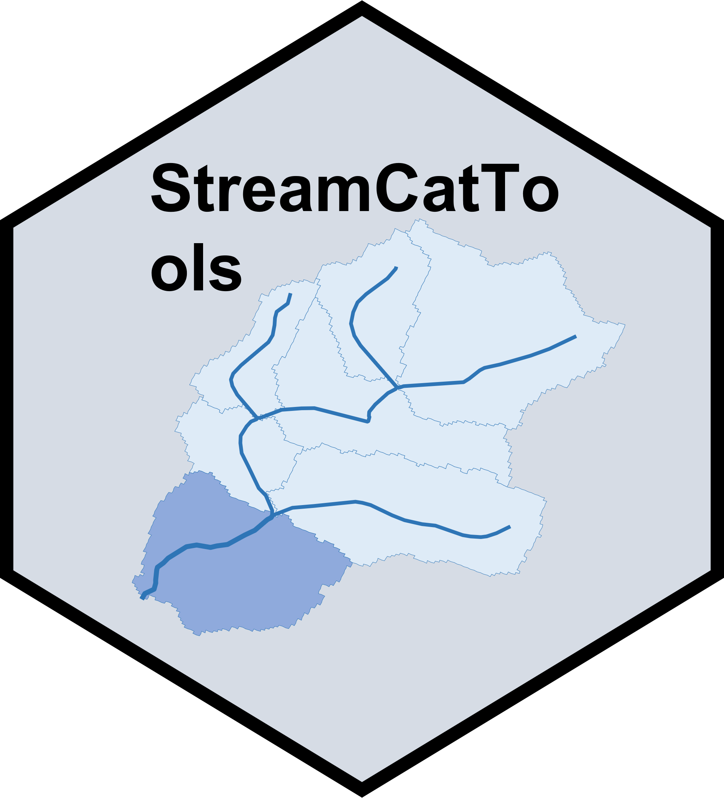

# StreamCatTools 

<!-- badges: start -->
=======
[](https://www.repostatus.org/#active)
[](https://cran.r-project.org/package=StreamCatTools)
[](https://cran.r-project.org/web/checks/check_results_StreamCatTools.html)
[](https://github.com/USEPA/StreamCatTools/actions/workflows/R-CMD-check.yaml)
[](https://cran.r-project.org/package=StreamCatTools)
<!-- badges: end -->

## StreamCatTools: Tools to work with the [StreamCat](https://www.epa.gov/national-aquatic-resource-surveys/streamcat-dataset) API within R and access the full suite of StreamCat and [LakeCat](https://www.epa.gov/national-aquatic-resource-surveys/lakecat-dataset) metrics.


`StreamCatTools` is an R package for accessing [StreamCat](https://www.epa.gov/national-aquatic-resource-surveys/streamcat-dataset) and [LakeCat](https://www.epa.gov/national-aquatic-resource-surveys/lakecat-dataset) data via the [StreamCat API](https://usepa.github.io/StreamCatWebServices_Public/#/) and for working with site data in conjunction with StreamCat and NHDPlus. 

### Installation

You can install and load the most recent approved version from CRAN by running

```r
# install the most recent approved version from CRAN
install.packages("StreamCatTools")
# load the most recent approved version from CRAN
library(StreamCatTools)
```
You can install and load the most recent development version from GitHub by running:

```r
library(remotes)
install_github("USEPA/StreamCatTools", build_vignettes=TRUE)
library(StreamCatTools)
```

To view the vignettes in RStudio, run
```r
vignette("Introduction", "StreamCatTools")
vignette("Applications", "StreamCatTools")
vignette("LakeCat", "StreamCatTools")
```
### Contributing
Contributions to development of the package are welcome and encouraged. Please consider the following guidlelines for contributing to `StreamCatTools`:

- We encourage package users to submit bugs and enhancement requests by submitting issues - see the [Quickstart for GitHub Issues](https://docs.github.com/en/issues/tracking-your-work-with-issues/quickstart) page if you are new to GitHub issues
- Contributions should use the standard GitHub [fork - pull-request workflow](https://gist.github.com/Chaser324/ce0505fbed06b947d962)
- We encourage use of the [tidyverse style guide](https://style.tidyverse.org/) for contributions
- Contributions should ideally be tested using [testthat](https://testthat.r-lib.org/)
- Make sure you use roxygen and run Check before contributing
- If you contribute to documentation, running `devtools::document()` and then `pkgdown::build_site()` will refresh the help docs and pkgdown pages (but do not push these packagedown changes - they are to verify changes locally)

### Python Implementation of StreamCat API
[PyNHD](https://github.com/hyriver/pynhd), part of the [HyRiver](https://github.com/hyriver) suite of Python packages, also provides access to StreamCat data via the API in Python, along with other NHDPlus value-added attributes for catchments and catchment and network accumulated values for catchments available via [USGS ScienceBase](https://www.sciencebase.gov/catalog/)

### Recommended Citation:
```
  Weber, Marc H, Hill, Ryan A., Brookes, Allen F. 2024, StreamCatTools: Tools to work with the StreamCat API within R and access the full suite of StreamCat and LakeCat metrics,
  https://usepa.github.io/StreamCatTools
```
### Disclaimer
The United States Environmental Protection Agency (EPA) GitHub project code is provided on an "as is" basis and the user assumes responsibility for its use.  EPA has relinquished control of the information and no longer has responsibility to protect the integrity , confidentiality, or availability of the information.  Any reference to specific commercial products, processes, or services by service mark, trademark, manufacturer, or otherwise, does not constitute or imply their endorsement, recommendation or favoring by EPA.  The EPA seal and logo shall not be used in any manner to imply endorsement of any commercial product or activity by EPA or the United States Government.
