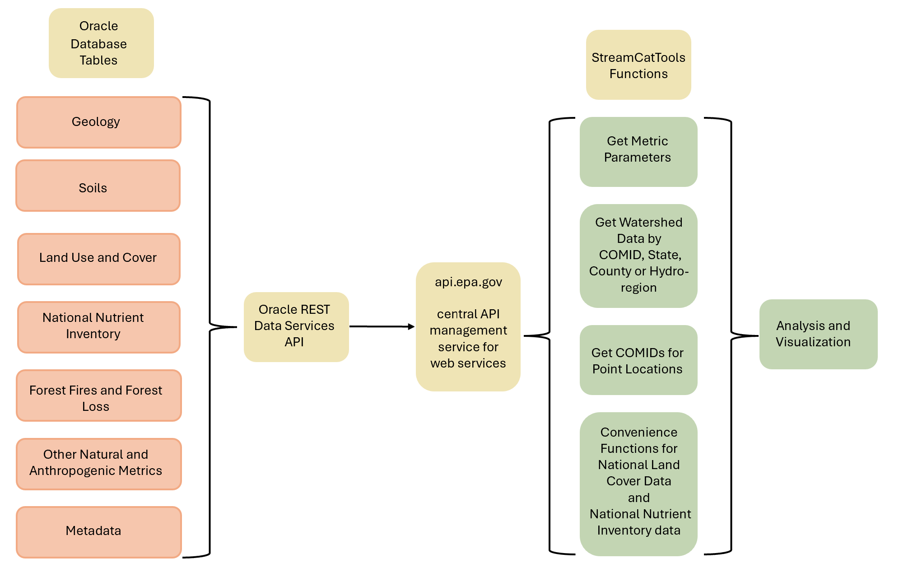

# Summary

`StreamCatTools` provides functions for easily working with, visualizing and analyzing StreamCat[@hill2016streamcat] and LakeCat[@hill2018lakecat] watershed metrics within **R**. The StreamCat and LakeCat datasets provide hundreds of landscape metrics for both the local catchment (e.g. landscape draining to a particular stream reach) and full watershed for every stream reach and lake depicted in the medium resolution National Hydrography Dataset Plus Version 2.1 (NHDPlusV21)[@mckay2012nhdplus] for the contiguous United States (CONUS). `StreamCatTools` functions wrap the application programming interface (API) for the StreamCat and LakeCat data and facilitate simple, straightforward access and use of these datasets within R.

# Statement of Need

Easily accessible, robust, and consistent watershed data is an underpinning of hydrology research, water quality monitoring programs, and predictive modelling applications, to name just a few examples.  The StreamCat[@hill2016streamcat] and LakeCat[@hill2018lakecat] datasets fill this need by providing nationally consistent curated watershed data for CONUS that has had stringent quality control applied. The data encompasses hundreds of watershed metrics for every stream reach and lake feature represented in the NHDPlusV21[@mckay2012nhdplus]. StreamCatTools fills the need for easily accessible watershed metrics for CONUS by: (1) providing a simple interface in R to the StreamCat and LakeCat web services, (2) providing convenient functionality to find available StreamCat and LakeCat metric names and information, (3) extracting StreamCat and LakeCat metrics by COMID (a unique identifier in the NHDPlusV2 framework), by state, by county, by NHD Hydro-region, or for all of CONUS. Providing this valuable watershed data via web services in R follows the FAIR principles laid out in [@wilkinson2016fair].

# StreamCatTools Functionality

`StreamCatTools` provides a simple streamlined set of functions to easily query and ingest watershed landscape metrics into an R session. Figure \@ref(fig:flowchart) shows the overall framework of the StreamCat database, application programming interface, and functionality in the package that simplifies data access in R using web services for the StreamCat and LakeCat datasets. 

```{r flowchart, fig.cap="The StreamCat framework: a backend Oracle database, web services exposed through api.gov, and functions in StreamCatTools which simplify accesss and analyzing the data in R via the API.", echo=FALSE, label="flowchart",  out.width="70%", fig.align="center"}

```

The core functionality of `StreamCatTools` entails simplifying the calls to the API for StreamCat and LakeCat data within the R programming language to allow a user to: 1) ask for details on available StreamCat and LakeCat metrics 2) Reference sites with location information to NHDPLusV2 catchments for stream and lake features in order to ask for StreamCat and LakeCat metrics and 3) Get StreamCat and LakeCat watershed metrics by COMID, by state, by county, by hydroregion, or for all of CONUS.  Additional functionality is provided in convenience functions get data all data for particular years for particular data sources such as the National Land Cover Database (NLCD) [@usgs_nlcd] and the National Nutrient Inventory (NNI) [@nutinventory].

Installing `StreamCatTools` 
```{r, eval = FALSE}
# library(remotes)
# install_github("USEPA/StreamCatTools", build_vignettes=FALSE)
```

`StreamCatTools` is loaded into an **R** session:
```{r, warning = FALSE}
library(StreamCatTools)
```

As we detail in the [package introduction page](https://usepa.github.io/StreamCatTools/articles/Articles/Introduction.html) we can list metric parameters and find out more about StreamCat and LakeCat data available in `StreamCatTools` using using the `sc_get_params` function. We can also see what metrics are available for what areas of interest and what years using the `sc_get_params` function (which returns a tibble of information about StreamCat metrics). Additional functions provided for getting metadata on the underlying StreamCat and LakeCat data include the `sc_fullname` and `lc_fullname` functions and the `sc_get_params` and `lc_get_params` functions. We can also filter metric names and information by the metric year(s), the indicator categories for metrics, the metric data set names, or the Areas of Interest the metrics are available for using the `sc_get_metric_names` or `lc_get_metric_names` functions.

The primary package functionality is in the `sc_get_data` and `lc_get_data` functions which allow users to extract whatever suite of metrics they are interested in from StreamCat or LakeCat using a provided set of unique identifiers of COMIDs for NHDPlusV2, or request a set of metrics for a given state(s), county(ies), hydroregion(s), or all of CONUS.  Additionally, convenience functions are provided for accessing the NLCD and NNI datasets using `sc_nlcd` and `lc_nlcd` and `sc_nni` and `lc_nni`. 

# Applications

We'll flesh this out with: examples from `StreamCatTools` page showing plotting of watersheds with particular data, merging with NLA data, and new functionality for accessing and plotting NNI data.  Perhaps any other uses / applications we are aware of (such as CASTools R Shiny app).

# Acknowledgements

Examples of using StreamCat and LakeCat make extensive use of `nhdplusTools`[@blodgett2016nhdplustools] and the functions for accessing the API are facilitated through use of `httr2`. Figures were created using `ggplot2` [@wickham2016ggplot2]. 

We would like to sincerely thank the editor and reviewers for all of their helpful feedback which greatly improved both the software and the manuscript.

The United States Environmental Protection Agency (EPA) GitHub project code is provided on an "as is" basis and the user assumes responsibility for its use. EPA has relinquished control of the information and no longer has responsibility to protect the integrity , confidentiality, or availability of the information. Any reference to specific commercial products, processes, or services by service mark, trademark, manufacturer, or otherwise, does not constitute or imply their endorsement, recommendation or favoring by EPA. The EPA seal and logo shall not be used in any manner to imply endorsement of any commercial product or activity by EPA or the United States Government.

# References
