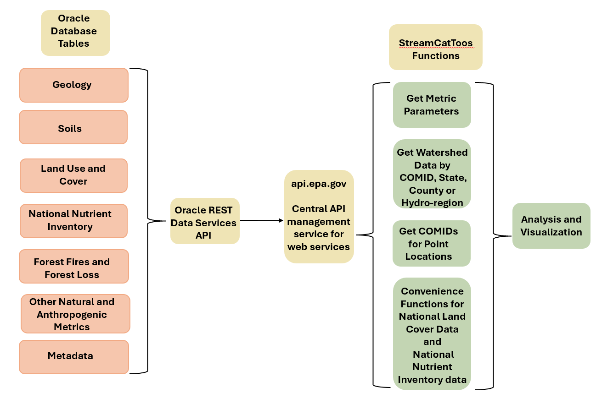

```{r setup, include=FALSE}
# Wrap base R printing around ~80 characters
options(width = 80)

# Tibbles/pillar also honor the width option; you can be explicit:
options(pillar.width = 80)

knitr::opts_chunk$set(comment = "#>", tidy = FALSE)
```

# Summary

`StreamCatTools` provides functions for easily working with, visualizing and analyzing StreamCat [@hill2016streamcat] <!-- In PDF, all authors are listed in citations rather than "Hill et al." -->and LakeCat [@hill2018lakecat] watershed metrics within **R**. The StreamCat and LakeCat datasets provide hundreds of landscape metrics for both the local catchment (e.g. landscape draining to a particular stream reach) and full watershed (i.e., the local catchment and all upstream catchments) for every stream reach and lake depicted in the medium resolution National Hydrography Dataset Plus Version 2.1 (NHDPlusV21)[@mckay2012nhdplus] for the contiguous United States (CONUS). `StreamCatTools` functions wrap the application programming interface (API) for the StreamCat and LakeCat online database and facilitate their simple, straightforward access and use within R.

# Statement of Need

Easily accessible, robust, and consistent watershed data underpin hydrology research, water quality monitoring programs, and predictive modelling applications, to name just a few examples.  The StreamCat [@hill2016streamcat] and LakeCat [@hill2018lakecat] datasets fill this need by providing nationally consistent curated watershed data for CONUS that have had stringent quality control applied. The data encompasses hundreds of watershed metrics for every stream reach and lake feature represented in the NHDPlusV21 [@mckay2012nhdplus]. StreamCatTools provides easily accessible watershed metrics for CONUS via: (1) a simple interface to the StreamCat and LakeCat web services in the R programming language; (2) convenient functionality to find available StreamCat and LakeCat metric names and information about variables; and (3) extraction of StreamCat and LakeCat metrics by COMID (a unique identifier in the NHDPlusV2 framework), state, county, NHD hydro-region, or for all of CONUS. Providing this valuable watershed data via web services in R follows the FAIR principles (Fair, Accessible, Interoperable, and Reusable) laid out in [@wilkinson2016fair].

# Package Overview

`StreamCatTools` provides a simple streamlined set of functions to easily query and ingest watershed landscape metrics into an R session. Figure \@ref(fig:flowchart) shows the overall framework of the StreamCat database, application programming interface, and functionality in the package that simplifies data access in R using web services for the StreamCat and LakeCat datasets. 

<!-- Spell out API in figure caption -->

```{r flowchart, fig.cap="Diagram of the StreamCat and StreamCatTools framework. The backend Oracle database and REST (Representational State Transfer) web service are exposed through api.gov to functions in StreamCatTools that simplify accesss and analysis of the data in R via the application programming interface (API). The example here shows the general categories of Oracle database tables in the StreamCat Oracle database", echo=FALSE, label="flowchart",  out.width="95%", fig.align="center"}

```

The core functions in `StreamCatTools` leverage the `httr2` library [@wickham2025httr2] for a modern, pipeable method for working with APIs. Specifically, `StreamCatTools` simplifies the calls to the API for StreamCat and LakeCat data within the R programming language to allow a user to: (1) access details on available StreamCat and LakeCat metrics; (2) match users' sites to NHDPlusV21 waterbodies (streams or lakes) to access site-relevant StreamCat and Lakecat data; and (3) retrieve StreamCat and LakeCat watershed metrics by COMID, by state, by county, by hydroregion, or for all of CONUS.  Additionally, several convenience functions to retrieve year-specific data for variables with time series data, such as the National Land Cover Database (NLCD) [@NLCD] and the National Nutrient Inventory (NNI) [@nutinventory]. Lastly, there is plotting functionality for use with NNI metrics as well as a function to retrieve the watersheds for specific lake features as an `sf` object.  Users also can access watersheds for specific COMIDs using the `nhdplusTools` package for visualization and plotting of watersheds along with StreamCat or LakeCat metrics.

You can install the most recent version of `StreamCatTools` from CRAN by running:

```{r, eval = FALSE}
install.packages("StreamCatTools")
```

You can install the most recent package version from GitHub by running:
<!-- jwh: recommend updating to pak.  remotes is eventually slated for replacement
https://remotes.r-lib.org/MAINTENANCE.html?q=pak#future-directions -->
```{r, eval = FALSE}
install.packages(“pak”)
library(pak)
pkg_install("github::USEPA/StreamCatTools")
```

`StreamCatTools` is loaded into an **R** session:

```{r, warning = FALSE}
library(StreamCatTools)
```

`StreamCatTools` includes several functions to facilitate accessing and working with the data. First, users can list metric names and find out more about StreamCat and LakeCat data available in StreamCat using using the `sc_get_params()` and `lc_get_params()` functions. The parameters `aoi` and `metric_names` provide a user with the available areas of interest for metrics and names of metrics.  The areas of interest available for all metrics in StreamCat and Lakecat are 'cat' and 'ws' (catchment and watershed) and in StreamCat some metrics are available at the 100 meter riparian buffer scale ('catrp100' and 'wsrp100') and for certain metrics the designation of 'other' needs to be used (where the metric is in-stream or derived and not part of the other listed areas of interest). Extracting this information in `StreamCatTools` looks like this:

<!-- Clean up these code chunks with the print/cat stuff.  All of this is getting echoed and all you really want is to see what the output looks like.  I would just allow it to use the default print.  I've changed this code chunk to what I would use.  If you want more customized prints, you'll need to get fancy so that the code doesn't echo.-->
```{r warning=FALSE, message=FALSE}
aois <- sc_get_params(param='aoi')
aois

name_params <- sc_get_params(param='metric_names')
name_params[1:10]

```


And the same information for LakeCat metrics is derived in similar fashion:

```{r warning=FALSE, message=FALSE}
aois <- lc_get_params(param='aoi')

name_params <- lc_get_params(param='metric_names')

print('areas of interest include: ')

cat(paste0(aois, collapse = "\n"))
```

```{r warning=FALSE, message=FALSE}
print('A selection of available LakeCat metrics include: ')

cat(paste0(name_params[1:10],collapse = "\n"))
```

StreamCat and LakeCat are built around the concepts of local drainage area (i.e catchment) and watershed (i.e. the local drainage area and all upstream catchments) [@hill2016streamcat].  This approach uses the NHDPlusV21 hydrographic framework of catchments as the building block for summarizing information represented in landscape data and then aggregating both the catchment landscape summary and all upstream catchment summaries using either the weighted average of metrics (in most cases) or a sum or count (for certain metrics). `sc_get_params()` and `lc_get_params()` also include a 'variable_info' parameter to return more detailed metadata for metrics including both short and long metric descriptions, years available (if applicable), units, and the metric category. 

<!-- jwh: Same as above comment, this code should not be included in the rendered doc.  update all code chunks creating table.  I added echo = FALSE to this one.  Also tables should have a caption.--> 
```{r warning=FALSE, message=FALSE, echo=FALSE}
var_info <- sc_get_params(param='variable_info')

my_data <- head(var_info[c(5,10,29,33,45,102),c('metric','short_description','year','units')])

knitr::kable(
  my_data,
  format = "latex",
  booktabs = TRUE,
  longtable = TRUE,
  col.names = c('Metric', 'Short Description', 'Year', 'Units'),
  align = "llll"
)  |> 
  kableExtra::kable_styling(
    latex_options = c("repeat_header"),
    font_size = 7
  )  |> 
  kableExtra::column_spec(1, width = "1.0in")  |> 
  kableExtra::column_spec(2, width = "1.0in")  |> 
  kableExtra::column_spec(3, width = "1.0in")  |> 
  kableExtra::column_spec(4, width = "1.0in")
```

Additional functions for getting metadata about the underlying StreamCat and LakeCat data include the `sc_fullname()` and `lc_fullname()` functions which provide the descriptive full name for any given metric in StreamCat or LakeCat:

```{r warning=FALSE, message=FALSE}
sc_fullname(metric='pctgrs2019')
```

Users can also filter metric names and information by the metric year(s), the indicator categories for metrics, the metric dataset names, or the areas of interest available for a given metric using the `sc_get_metric_names` or `lc_get_metric_names` functions:

```{r warning=FALSE, message=FALSE}
metrics <- sc_get_metric_names(category = c('Deposition','Climate'),
                               aoi=c('Cat','Ws'))
my_data <- head(metrics[,c('Category','Metric','AOI')],10)
knitr::kable(
  my_data,
  format = "latex",
  booktabs = TRUE,
  longtable = TRUE,
  col.names = c('Category','Metric','AOI'),
  align = "lll"
)  |> 
  kableExtra::kable_styling(
    latex_options = c("repeat_header"),
    font_size = 7
  )  |> 
  kableExtra::column_spec(1, width = "1.2in") |>  
  kableExtra::column_spec(2, width = "1.4in") |>   
  kableExtra::column_spec(3, width = "1.0in")   
```

More details on these functions can be found at the [package introduction page](https://usepa.github.io/StreamCatTools/articles/Articles/Introduction.html). 

The primary package functionality is in the `sc_get_data` and `lc_get_data` functions which allow users to extract catchment or watershed metrics of interest by providing NHDPlusV21 COMIDs for streams or lakes within the database. Users can also request data for a given state(s), county(ies), hydroregion(s), or all of CONUS.  Additionally, convenience functions are provided for accessing the NLCD and NNI datasets, respectively, using `sc_get_nlcd` and `lc_get_nlcd` and `sc_get_nni` and `lc_get_nni`:

```{r warning=FALSE, message=FALSE}
df <- sc_get_nlcd(comid='1337420', year='2019', aoi='ws')
```

```{r, warning=FALSE, message=FALSE, eval=FALSE}
df <- sc_get_nni(year='1987, 1990, 2005, 2017', aoi='cat,ws',
                 comid='179,1337,1337420')
```

The following example shows a request for two catchment and watershed metrics for three stream reaches:

```{r warning=FALSE, message=FALSE}
df <- sc_get_data(metric='pcturbmd2019,damdens',
                  aoi='cat,ws', 
                  comid='179,1337,1337420')
```

The first line requests percent of NLCD medium intensity developed land cover in 2019 and the density of dams. The second line specifies that the geographic area of interest (aoi) is the drainage to the local reach scale (i.e. 'cat', short for catchment) and the full watershed. Finally, the final line request this data for three NHDPlusV2 stream segments specified by their unique COMIDs.  A similar request for LakeCat metrics for data on lakes might look like this, where we ask for data for a particular county using the county FIPS code rather than for a set of identifying COMIDs:

```{r warning=FALSE, message=FALSE}
df <- lc_get_data(metric='pctwdwet2006', aoi='ws', county='41003')
```

`StreamCatTools` provides a convenience function in either `sc_get_params` or `lc_get_params` to discover the FIPS codes for states and counties in order to make it easier for users to query data by these parameters. For example, the following code chunk shows how to get the FIPS code for Benton County, Oregon in order to query data for that county:

```{r warning=FALSE, message=FALSE, eval=FALSE}
lc_get_params(param='county') |> dplyr::filter(state == 'OR' & county_name == 'Benton') |> dplyr::pull(fips)`
```

# Applications and Discussion

Watershed metrics from `StreamCatTools` can be easily visualized with functions from `nhdplusTools` [@blodgett2016nhdplustools] and `ggplot2` [@wickham2016ggplot2]. The example below plots the NLCD percent imperviousness for the the local drainage (catchment in NHDPlusV2 syntax) and displays the values mapped to each stream reach and to the overall basin boundary:

```{r warning=FALSE, message=FALSE}
library(nhdplusTools)
library(ggplot2)
library(ggspatial)
library(StreamCatTools)

start_comid = 23763517
nldi_feature <- list(featureSource = "comid", featureID = start_comid)
flowline_nldi <- nhdplusTools::navigate_nldi(nldi_feature, mode = "UT", data_source = "flowlines", distance=5000)
df <- sc_get_data(metric='pctimp2019', aoi='cat', comid=flowline_nldi$UT_flowlines$nhdplus_comid)
flowline_nldi <- flowline_nldi$UT_flowlines
flowline_nldi$PCTIMP2019 <- df$pctimp2019cat[match(flowline_nldi$nhdplus_comid, df$comid)]
basin <- nhdplusTools::get_nldi_basin(nldi_feature = nldi_feature)

calapooia <- ggplot() +
    geom_sf(data = basin,
            fill = NA,
            color = "black",
            linewidth = 1) +
    geom_sf(data = flowline_nldi,
            aes(colour = PCTIMP2019)) +
    scale_y_continuous() +
    scale_color_distiller(palette = "Spectral") +
    labs(color = "Pct Imperviousness") +
    theme_minimal(12) +
    ggtitle('Percent Imperviousness for \nthe Calapooia River Basin 2019')

plot(calapooia)
```

Watersheds for lakes can also be retrieved using the `lc_get_watershed` function in order to visualize LakeCat metrics along with the plotted watersheds for lake features:

```{r warning=FALSE, message=FALSE}
library(ggplot2)
library(patchwork)
library(ggforce)

df <- lc_get_nlcd(comid='19334077', year='2019', aoi='ws')
lake <- nhdplusTools::get_waterbodies(id = 19334077)
ws <- lc_get_watershed(comid = 19334077, huc2 = "01",huc2_filter = "01", 
                      threads = 2,retries = 5, verbose=FALSE, progress=FALSE)
df <- df |>
  dplyr::mutate(
    PctConifer = pctconif2019ws,
    PctDeciduous = pctdecid2019ws,
    PctMixedForest = pctmxfst2019ws,
    PctAgriculture = pctcrop2019ws + pcthay2019ws,
    PctShrub = pctshrb2019ws,
    PctGrass = pctgrs2019ws,
    PctWetland = pcthbwet2019ws + pctwdwet2019ws,
    PctUrban = pcturbhi2019ws + pcturblo2019ws + pcturbmd2019ws + pcturbop2019ws
  ) |>
  dplyr::select(PctConifer, PctDeciduous, PctMixedForest, PctAgriculture, PctShrub, PctGrass, PctWetland, PctUrban)

landcover_df <- df |>
  tidyr::pivot_longer(
    cols = c(PctConifer, PctDeciduous, PctMixedForest, PctAgriculture,
             PctShrub, PctGrass, PctWetland, PctUrban),
    names_to = "category",
    values_to = "value"
  ) |>
  dplyr::mutate(
    category = factor(category,
      levels = c("PctConifer","PctDeciduous","PctMixedForest","PctAgriculture",
                 "PctShrub","PctGrass","PctWetland","PctUrban")
    ),
    pct_label = ifelse(value >= 5, paste0(round(value, 1), "%"), "")  # blank label if < 5%
  )

pie_colors <- c(
  PctConifer      = "#08519c",
  PctDeciduous    = "#74c476",
  PctMixedForest  = "#fec44f",
  PctAgriculture  = "#d8b365",
  PctShrub        = "#8c510a",
  PctGrass        = "#bdbdbd",
  PctWetland      = "#41b6c4",
  PctUrban        = "#de2d26"
)

# --- map ---
p_map <- ggplot() +
  geom_sf(data = ws, fill = "grey90", color = "black", linewidth = 0.6) +
  geom_sf(data = lake, fill = "#4393c3", color = "#2166ac", linewidth = 0.3) +
  theme_void() +
  labs(title = "Watershed Boundary") +
  theme(plot.title = element_text(hjust = 0.5, face = "bold"))

# --- pie ---
p_pie <- ggplot(landcover_df, aes(x = "", y = value, fill = category)) +
  geom_col(width = 1, color = "white") +
  coord_polar(theta = "y") +
  geom_text(aes(label = pct_label), position = position_stack(vjust = 0.5), size = 3, color = "black") +
  scale_fill_manual(values = pie_colors, name = "Land Cover") +
  theme_void() +
  labs(title = "Land Cover Composition") +
  theme(plot.title = element_text(hjust = 0.5, face = "bold"))

p_map + p_pie + plot_layout(ncol = 2, widths = c(1, 1))
```

Plotting functions to specifically plot NNI metrics in StreamCat have been developed and are also available [@MarkleyNNI] such as the following example to plot annual time series of nitrogen and phosphorus budget data for a given watershed such as the Mississippi-Atchafalaya River Basin:

```{r warning=FALSE, message=FALSE}
library(StreamCatTools)
library(ggplot2)
library(ggpattern)
com <- '22812041'
sc_plotnni(comid = com, include.nue = TRUE)
```

Future functionality for `StreamCatTools` includes expanding the scope of plotting functions as well as expanding the range of metrics and ease of querying these metrics. Additionally, an complementary package, `StreamCatR` is being developed that will allow users to quickly and easily process their own landscape metrics to the NHDPlus framework or other hydrlolgic frameworks with network topology. `StreamCatTools` currently facilitates easy ingestion of StreamCat and LakeCat watershed landscape metrics into workflows in R which is of great use to state watershed planners, researchers and non-governmental organizations and borne out by the over 5000 package downloads and over 350 citations of the underlying StreamCat and LakeCat data served by the `StreamCatTools` package.

# Acknowledgements

Examples of using StreamCat and LakeCat make extensive use of `nhdplusTools`[@blodgett2016nhdplustools] and the functions for accessing the API are facilitated through use of `httr2`[@wickham2025httr2]. Figures were created using `ggplot2` [@wickham2016ggplot2]. 

We would like to sincerely thank the editor and reviewers for all of their helpful feedback which greatly improved both the software and the manuscript.

The United States Environmental Protection Agency (EPA) GitHub project code is provided on an "as is" basis and the user assumes responsibility for its use. EPA has relinquished control of the information and no longer has responsibility to protect the integrity , confidentiality, or availability of the information. Any reference to specific commercial products, processes, or services by service mark, trademark, manufacturer, or otherwise, does not constitute or imply their endorsement, recommendation or favoring by EPA. The EPA seal and logo shall not be used in any manner to imply endorsement of any commercial product or activity by EPA or the United States Government.The information in this document has been funded entirely by the United States Environmental Protection Agency (USEPA), in part through appointments to the USEPA’s Internship/Research Participation Program at the Office of Research and Development administered by the Oak Ridge Institute for Science and Education through an interagency agreement. The views expressed in this article are those of the authors and do not necessarily represent the views or policies of the USEPA. 

# References

