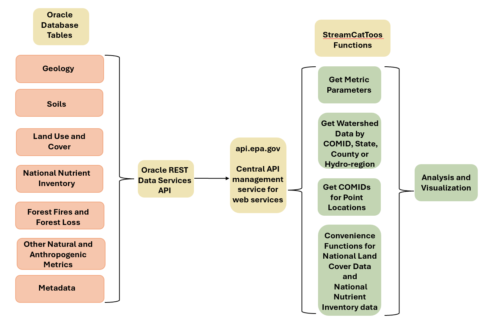

```{r setup, include=FALSE}
# Wrap base R printing around ~80 characters
options(width = 80)

# Tibbles/pillar also honor the width option; you can be explicit:
options(pillar.width = 80)

knitr::opts_chunk$set(comment = "#>", tidy = FALSE)
```

# Summary

`StreamCatTools` provides an R interface to the StreamCat[@hill2016streamcat] and LakeCat[@hill2018lakecat] data and APIs for retrieving nationally consistent watershed and lake-basin metrics in a reproducible workflow. Built on the NHDPlusV21 [@mckay2012nhdplus] framework, the package gives researchers and managers direct, simple access to hundreds of catchment- and watershed-scale metrics without requiring manual geospatial accumulation.

# Statement of Need

Nationally consistent watershed data are essential for hydrology, water-quality assessment, and ecological modeling.  StreamCat and LakeCat provide such data for every NHDPlusV21 stream reach and lake basin in the conterminous United States, with hundreds of metrics summarizing land cover, disturbance, hydrology, and other landscape conditions. StreamCatTools makes these data accessible in R through a simple API wrapper, metric discovery functions, and batched retrieval by COMID, state, county, hydroregion, or CONUS. This lowers the barrier to reproducible analysis and supports the FAIR principles (Findable, Accessible, Interoperable, and Reusable) [@wilkinson2016fair] by making a standard national dataset easier to discover and reuse.

# State of the Field

Several R packages already cover network navigation, observational data retrieval, and general-purpose geospatial layers, but fewer provide analysis-ready watershed metrics aggregated to stream catchments and upstream watersheds. StreamCat and LakeCat fill this gap by providing pre-computed landscape summaries for every NHDPlusV21 stream reach and lake basin in the conterminous United States. `StreamCatTools` provides the programmatic entry point to these data, allowing users to retrieve analysis-ready covariates without first accumulating the stream network or assembling large geospatial layers. The package is used in water-quality modeling, biological condition assessment, and Clean Water Act applications.

# Package Overview

`StreamCatTools` is a lightweight R interface to the StreamCat and LakeCat APIs. The package exposes functions for metadata discovery, metric lookup, and batched data retrieval from the StreamCat and LakeCat REST services, using `httr2` [@wickham2025httr2] to simplify request construction and response handling. The core functions retrieve variables by COMID, state, county, hydroregion, or CONUS, and also support National Land Cover Database (NLCD) [@NLCD] and National Nutrient Inventory (NNI) [@nutinventory] time-series products.

```{r flowchart, fig.cap="Diagram of the StreamCat and StreamCatTools framework. The backend Oracle database and REST web service are exposed through api.epa.gov to functions in StreamCatTools that simplify access and analysis of the data in R via the application programming interface (API). The example here shows the general categories of Oracle database tables in the StreamCat Oracle database.", echo=FALSE, fig.align="center", out.width="95%"}

```

You can install the most recent version of `StreamCatTools` from *CRAN* by running:

```{r, eval = FALSE}
install.packages("StreamCatTools")
```

You can install the most recent package version from *GitHub* by running the following code:

```{r, eval = FALSE}
install.packages("pak")
library(pak)
pkg_install("github::USEPA/StreamCatTools")
```

`StreamCatTools` is loaded into an **R** session:

```{r, warning = FALSE}
library(StreamCatTools)
```

Users can inspect available metric names and areas of interest before querying the API. For example, the `aoi` parameter returns the supported areas of interest and the `metric_names` parameter returns the available metric names. The supported AOIs include catchment (cat), watershed (ws), riparian catchment (catrp100), riparian watershed (wsrp100), and an other category for metrics that are not summarized using the standard catchment/watershed framework. Extracting this information in `StreamCatTools` looks like this:

```{r warning=FALSE, message=FALSE}
aois <- sc_get_params(param='aoi')
aois
```

```{r warning=FALSE, message=FALSE}
names <- sc_get_params(param='metric_names')
names[1:10]
```

The same pattern applies to LakeCat metadata retrieval with `lc_get_params()`.

StreamCat and LakeCat are built around the concepts of local drainage area and watershed, where individual catchments are aggregated to the full upstream watershed using either a weighted average or a count/sum depending on the metric [@hill2016streamcat]. `sc_get_params()` and `lc_get_params()` also return variable metadata, including short and long descriptions, units, years, and metric categories (Table 1)

```{r variable-table, warning=FALSE, message=FALSE, echo=FALSE, results='asis'}
var_info <- sc_get_params(param = "variable_info")
my_data <- head(var_info[c(5, 10, 29, 33, 45, 102), c("metric", "short_description", "year", "units")])

knitr::kable(
  my_data,
  format = "pipe",
  caption = "Example of variable information returned by the variable_info parameter in the sc_get_params function.",
  col.names = c("Metric", "Short Description", "Year", "Units"),
  align = "llll"
)
```

Additional metadata functions include `sc_fullname()` and `lc_fullname()`, which return the full descriptive name for a given metric.:

```{r warning=FALSE, message=FALSE}
sc_fullname(metric='pctgrs2019')
```

Users can also filter available metrics by year, category, dataset, and AOI using `sc_get_metric_names()` and `lc_get_metric_names()` (Table 2).

```{r warning=FALSE, message=FALSE}
metrics <- sc_get_metric_names(category = c('Deposition','Climate'),
                               aoi=c('Cat','Ws'))
my_data <- head(metrics[,c('Category','Metric','AOI')],10)
```

```{r metrics-table, warning=FALSE, message=FALSE, echo=FALSE, results='asis'}
knitr::kable(
  my_data,
  format = "pipe",
  caption = "Example of metric names returned by the sc_get_metric_names function.",
  col.names = c("Category", "Metric", "AOI"),
  align = "lll"
)   
```

More details on these functions can be found at the [package introduction page](https://usepa.github.io/StreamCatTools/articles/Articles/Introduction.html). 

The primary package functionality is in `sc_get_data()` and `lc_get_data()`, which allow users to extract catchment or watershed metrics by NHDPlusV21 COMID or by spatial filter such as county, state, hydroregion, or CONUS. The following example shows a request for two catchment and watershed metrics for three stream reaches:

```{r warning=FALSE, message=FALSE}
df <- sc_get_data(metric='pcturbmd2019,damdens',
                  aoi='cat,ws', 
                  comid='179,1337,1337420')
```

The first line requests percent of NLCD medium intensity developed land cover in 2019 and the density of dams. The second line specifies that the geographic area of interest (aoi) is the drainage to the local reach scale (i.e. 'cat', short for catchment) and the full watershed. The final line requests these data for three NHDPlusV21 stream segments specified by their unique COMIDs.  A parallel LakeCat request can be made by county or other spatial filter, for example by querying county FIPS codes for a state or county-level summary.:

```{r warning=FALSE, message=FALSE}
df <- lc_get_data(metric='pctwdwet2006', aoi='ws', county='41003')
head(df)
```

Users can also query by state, county, hydroregion, or CONUS, and helper functions are available to discover the relevant FIPS codes.:  

```{r warning=FALSE, message=FALSE}
df <- sc_get_data(metric='pctwdwet2006', aoi='ws', county='41003')
```

The package includes convenience helpers to discover county FIPS codes and to simplify state- and county-level queries.:

```{r warning=FALSE, message=FALSE, eval=FALSE}
df <- sc_get_params(param='county') |> dplyr::filter(state == 'OR' & county_name == 'Benton County') |> dplyr::pull(fips)
```

Or we can ask for several different metrics for all of a state:

```{r warning=FALSE, message=FALSE}
# State-wide watershed queries are large; run the live call once, then
# cache to disk so subsequent knits read the cache instead of
# re-hitting (or stalling on) the API. Commit the .rds alongside paper.Rmd.
ct_cache <- "clay_agkffact_CT_ws.rds"
if (file.exists(ct_cache)) {
  df <- readRDS(ct_cache)
} else {
  df <- sc_get_data(metric = 'clay,agkffact', aoi = 'ws', state = 'CT')
  saveRDS(df, ct_cache)
}
head(df)
```

StreamCatTools also provides convenience functions for the NLCD and NNI datasets through `sc_get_nlcd()`, `lc_get_nlcd()`, `sc_get_nni()`, and `lc_get_nni()`:

```{r warning=FALSE, message=FALSE}
df <- sc_get_nlcd(comid='1337420', year='2019', aoi='ws')
```

```{r, warning=FALSE, message=FALSE, eval=FALSE}
df <- sc_get_nni(year='1987, 1990, 2005, 2017', aoi='cat,ws',
                 comid='179,1337,1337420')
```

# Software design

`StreamCatTools` is designed as a lightweight wrapper around the StreamCat and LakeCat REST services. Requests are issued through `httr2`, with functions grouped into matching `sc_*` and `lc_*` families for stream and lake metrics. Data access functions accept metric names, spatial filters, and AOI syntax, then return tidy data frames ready for analysis. The package integrates with spatial workflows through `sf` and `hydrogeofetch`, and the lake-basin workflow uses DuckDB-backed geometry access for efficient retrieval.

# Applications and Discussion

`StreamCatTools` is useful for summarizing watershed metrics across many reaches, lakes, or counties and for linking those summaries to spatial analyses and ecological models. For example, users can calculate county- or state-scale summaries of land cover or hydrologic stressors and then combine those outputs with `ggplot2` or `hydrogeofetch`-based mapping workflows such as in the following examples:

```{r warning=FALSE, message=FALSE}
df <- sc_get_data(metric='pctagslphigh2019', aoi='ws', county='41003') |>
  dplyr::summarise(mean_pctagslphigh2019ws = mean(pctagslphigh2019ws, na.rm=TRUE))
df
```

```{r warning=FALSE, message=FALSE}
library(hydrogeofetch)
library(ggplot2)
library(ggspatial)
library(StreamCatTools)

start_comid = 23763517
nldi_feature <- list(featureSource = "comid", featureID = start_comid)
flowline_nldi <- hydrogeofetch::navigate_nldi(nldi_feature, mode = "UT", data_source = "flowlines", distance=5000)
df <- sc_get_data(metric='pctimp2019', aoi='cat', comid=flowline_nldi$UT_flowlines$nhdplus_comid)
flowline_nldi <- flowline_nldi$UT_flowlines
flowline_nldi$PCTIMP2019 <- df$pctimp2019cat[match(flowline_nldi$nhdplus_comid, df$comid)]
basin <- hydrogeofetch::get_nldi_basin(nldi_feature = nldi_feature)
```

Figure \ref{fig:calapooia} plots the NLCD percent imperviousness (percentage of area covered by constructed, artificial surfaces) for the local drainage (catchment in NHDPlusV21 syntax) and displays the values mapped to each stream reach and to the overall basin boundary.

```{r calapooia, fig.cap="Map of NLCD percent imperviousness for each catchment for the Calapooia River watershed in Oregon.", warning=FALSE, message=FALSE, echo=FALSE, out.width="95%", fig.align="center"}
calapooia <- ggplot() +
    geom_sf(data = basin,
            fill = NA,
            color = "black",
            linewidth = 1) +
    geom_sf(data = flowline_nldi,
            aes(colour = PCTIMP2019)) +
    scale_y_continuous() +
    scale_color_distiller(palette = "Spectral") +
    labs(color = "Pct Imperviousness") +
    theme_minimal(12) +
    ggtitle('Percent Imperviousness for \nthe Calapooia River Basin 2019')

plot(calapooia)
```

Watersheds for lakes can also be retrieved using `lc_get_watershed()` to visualize lake-basin metrics alongside watershed boundaries and land-cover composition as shown in Figure \ref{fig:landcover}.

```{r warning=FALSE, message=FALSE}
library(ggplot2)
library(patchwork)
library(ggforce)

df <- lc_get_nlcd(comid='19334077', year='2019', aoi='ws')
lake <- hydrogeofetch::get_waterbodies(id = 19334077)
ws <- lc_get_watershed(comid = 19334077, huc2 = "01",huc2_filter = "01", 
                      threads = 2,retries = 5, verbose=FALSE, progress=FALSE)
```

```{r landcover, fig.cap="NLCD land cover proportions with an example lake watershed.", warning=FALSE, message=FALSE, echo=FALSE, out.width="95%", fig.align="center"}
df <- df |>
  dplyr::mutate(
    PctConifer = pctconif2019ws,
    PctDeciduous = pctdecid2019ws,
    PctMixedForest = pctmxfst2019ws,
    PctAgriculture = pctcrop2019ws + pcthay2019ws,
    PctShrub = pctshrb2019ws,
    PctGrass = pctgrs2019ws,
    PctWetland = pcthbwet2019ws + pctwdwet2019ws,
    PctUrban = pcturbhi2019ws + pcturblo2019ws + pcturbmd2019ws + pcturbop2019ws
  ) |>
  dplyr::select(PctConifer, PctDeciduous, PctMixedForest, PctAgriculture, PctShrub, PctGrass, PctWetland, PctUrban)

landcover_df <- df |>
  tidyr::pivot_longer(
    cols = c(PctConifer, PctDeciduous, PctMixedForest, PctAgriculture,
             PctShrub, PctGrass, PctWetland, PctUrban),
    names_to = "category",
    values_to = "value"
  ) |>
  dplyr::mutate(
    category = factor(category,
      levels = c("PctConifer","PctDeciduous","PctMixedForest","PctAgriculture",
                 "PctShrub","PctGrass","PctWetland","PctUrban")
    ),
    pct_label = ifelse(value >= 5, paste0(round(value, 1), "%"), "")  # blank label if < 5%
  )

pie_colors <- c(
  PctConifer      = "#08519c",
  PctDeciduous    = "#74c476",
  PctMixedForest  = "#fec44f",
  PctAgriculture  = "#d8b365",
  PctShrub        = "#8c510a",
  PctGrass        = "#bdbdbd",
  PctWetland      = "#41b6c4",
  PctUrban        = "#de2d26"
)

# --- map ---
p_map <- ggplot() +
  geom_sf(data = ws, fill = "grey90", color = "black", linewidth = 0.6) +
  geom_sf(data = lake, fill = "#4393c3", color = "#2166ac", linewidth = 0.3) +
  theme_void() +
  labs(title = "Watershed Boundary") +
  theme(plot.title = element_text(hjust = 0.5, face = "bold"))

# --- pie ---
p_pie <- ggplot(landcover_df, aes(x = "", y = value, fill = category)) +
  geom_col(width = 1, color = "white") +
  coord_polar(theta = "y") +
  geom_text(aes(label = pct_label), position = position_stack(vjust = 0.5), size = 3, color = "black") +
  scale_fill_manual(values = pie_colors, name = "Land Cover") +
  theme_void() +
  labs(title = "Land Cover Composition") +
  theme(plot.title = element_text(hjust = 0.5, face = "bold"))

p_map + p_pie + plot_layout(ncol = 2, widths = c(1, 1))
```
Functions for plotting NNI metrics are also included [@MarkleyNNI], enabling time-series exploration for nitrogen and phosphorus budgets in a selected watershed \ref{fig:NNI}.

```{r NNI, fig.cap="Annual time series of nitrogen and phosphorus budget data for the Mississippi-Atchafalaya River Basin.", warning=FALSE, message=FALSE,  out.width="95%", fig.align="center"}
library(StreamCatTools)
library(ggplot2)
library(ggpattern)
com <- '22812041'
sc_plotnni(comid = com, include.nue = TRUE)
```

Future functionality for `StreamCatTools` includes expanding the scope of plotting functions as well as expanding the range of metrics and ease of querying these metrics. Additionally, a complementary package, `StreamCatR` is being developed that will allow users to quickly and easily process their own landscape metrics to the NHDPlus framework or other hydrologic frameworks with network topology. These features support a broader objective of making national-scale watershed data more accessible and reproducible for management and research applications. 


`StreamCatTools` currently facilitates easy ingestion of StreamCat and LakeCat watershed landscape metrics into workflows in R which is of great use to state watershed planners, researchers and non-governmental organizations and borne out by the over 12000 package downloads and over 350 citations of the underlying StreamCat and LakeCat data that are served by the `StreamCatTools` package.

# Research impact

`StreamCatTools` provides a reproducible, programmatic pathway to nationally consistent catchment and watershed summaries from the StreamCat and LakeCat datasets. By exposing metric discovery, batched retrieval, and spatial integration in a single R interface, the package makes a heavily used national dataset easier to access, analyze, and apply in monitoring, ecological assessment, and management decisions. Beyond research, the metrics support management and regulatory applications under Clean Water Act authorities, including antidegradation and healthy-watersheds assessments in state integrated reporting, as well as species-distribution and aquatic-connectivity studies.


# Acknowledgements

Examples of using StreamCat and LakeCat make extensive use of `hydrogeofetch` [@blodgett2026hydrogeofetch] and the functions for accessing the API are facilitated through use of `httr2` [@wickham2025httr2]. Figures were created using `ggplot2` [@wickham2016ggplot2]. 

We would like to sincerely thank Michael Dumelle and Jeff Hollister for helpful comments which improved this manuscript as well as the editor and reviewers for all of their helpful feedback which greatly improved both the software and the manuscript.

The United States Environmental Protection Agency (EPA) GitHub project code is provided on an "as is" basis and the user assumes responsibility for its use. EPA has relinquished control of the information and no longer has responsibility to protect the integrity , confidentiality, or availability of the information. Any reference to specific commercial products, processes, or services by service mark, trademark, manufacturer, or otherwise, does not constitute or imply their endorsement, recommendation or favoring by EPA. The EPA seal and logo shall not be used in any manner to imply endorsement of any commercial product or activity by EPA or the United States Government.The information in this document has been funded entirely by the United States Environmental Protection Agency (USEPA), in part through appointments to the USEPA’s Internship/Research Participation Program at the Office of Research and Development administered by the Oak Ridge Institute for Science and Education through an interagency agreement. The views expressed in this article are those of the authors and do not necessarily represent the views or policies of the USEPA. 

# AI Usage Disclosure

The R code for this R package was initially developed by Marc Weber and minimal generative AI was used for the most recent version of the package where several functions were refactored.

# References

